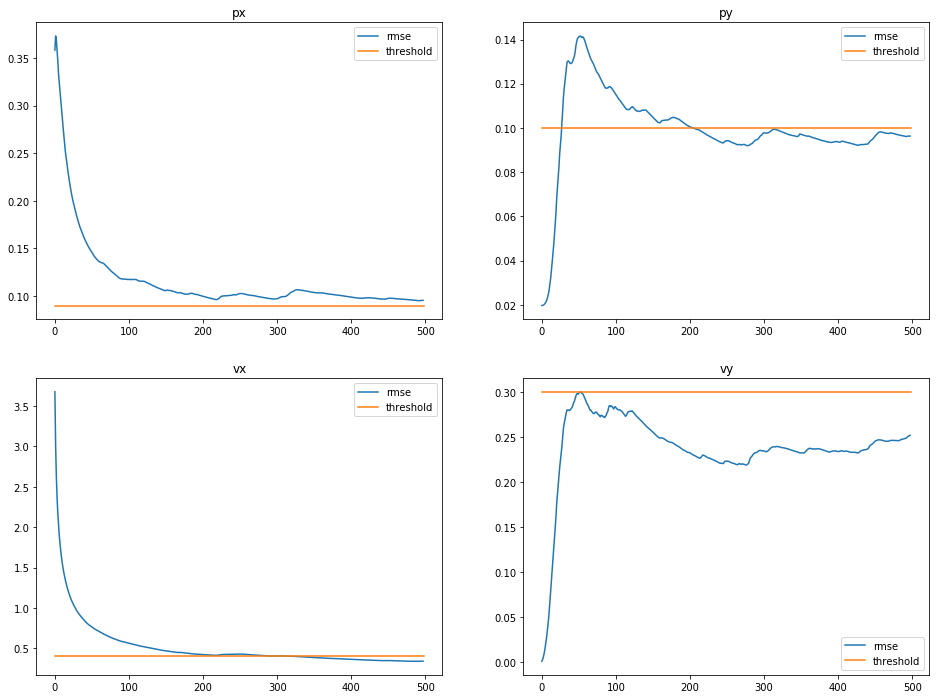
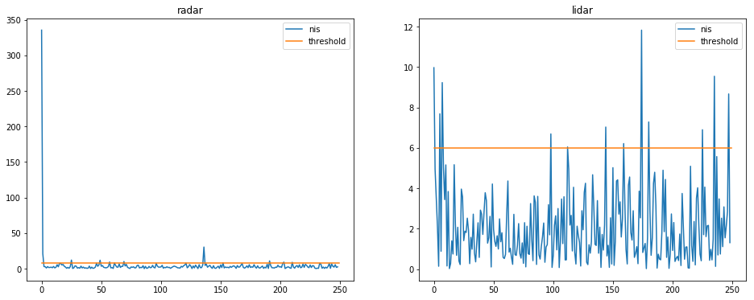
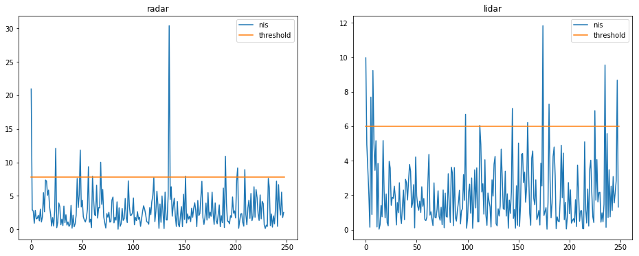
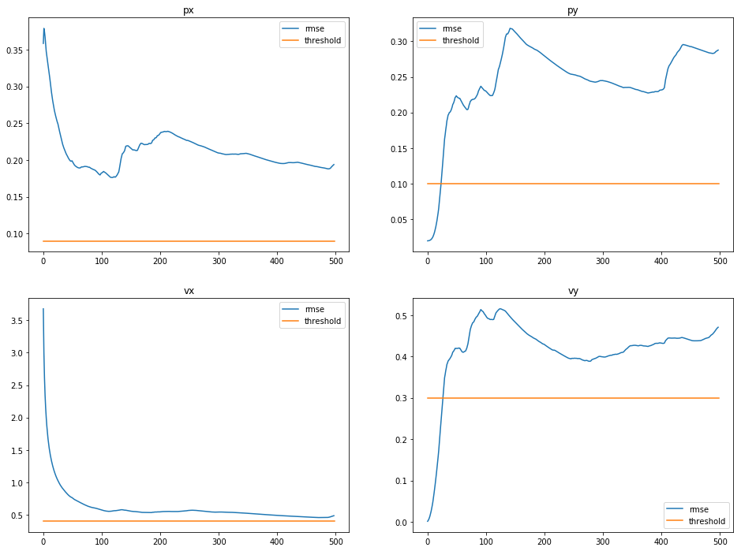
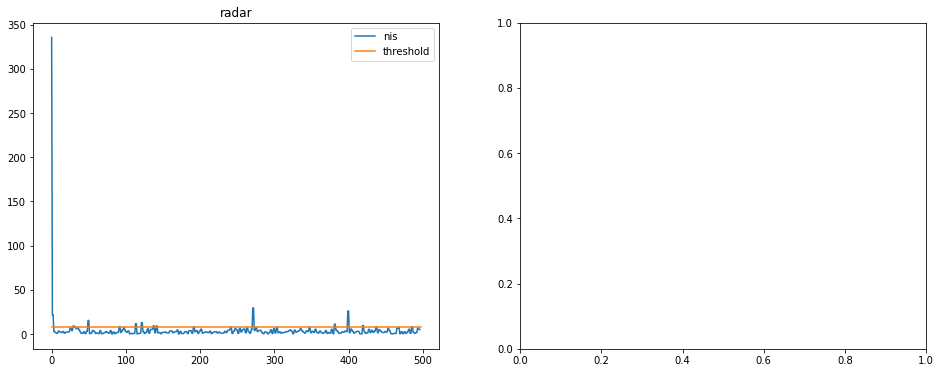
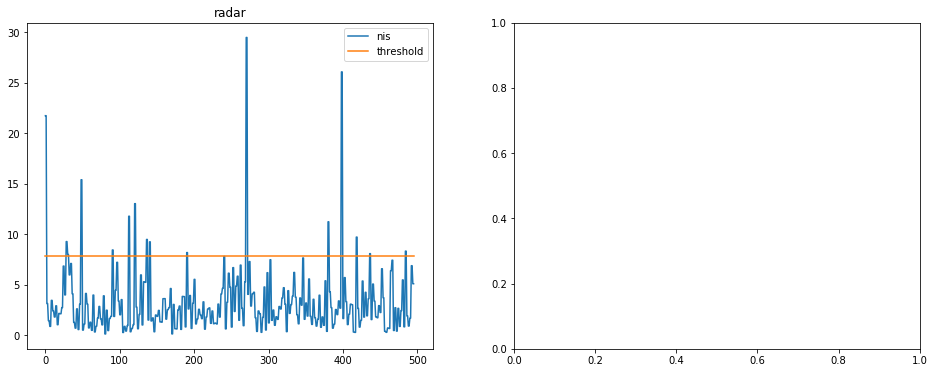
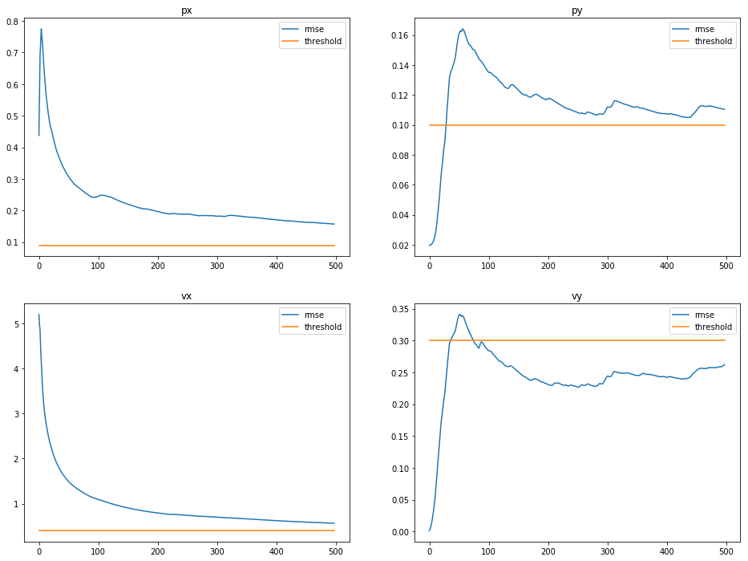
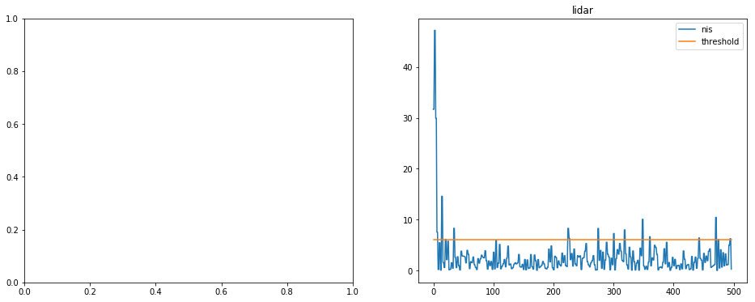

# Unscented Kalman Filter Project Starter Code
Self-Driving Car Engineer Nanodegree Program

In this project I use an Unscented Kalman Filter to estimate the state of a moving object of interest with noisy LIDAR and radar measurements.

## Chosing process noise values

One of the challenges of the project was to find appropriate process noise values for the longitudinal acceleration and yaw acceleration. I started with standard deviation values for the yaw acceleration in the interval of [Pi/8, Pi/32] and for the longitudinal acceleration in the interval [2-10]. In the end, I chose Pi/16 rad/s.s for the yaw acceleration standard deviation and 3 m/s.s for the longitudinal acceleration.

Considering the above yaw acceleration standard deviation, 95% of samples are within a yaw acceleration of 2*Pi/16 = 0.3927 rad/s.s. After 1 s, starting from 0 rad/s, the yaw velocity would be 0.3927 rad/s and full circle would be completed in 16.0 s, resulting in a tangential velocity for a radius of 16 m of 6.2832 m/s.

After 1 s, starting from 0.3927 rad/s, the yaw velocity would be 0.7854 rad/s and a full circle would be completed in 8.0 s, resulting in a tangential velocity for a radius of 16 m of 12.5664 m/s

The longitudinal acceleration for this change would be 6.2832 m/s.s. Since 95% of samples are within a longitudinal acceleration of 6 m/s.s, the value chosen for the longitudinal acceleration standard deviation is appropriate.

## Simulation results

# Using both sensors

It can be observed that the error (Root Mean Squared Error) of all variables is below the threshold at the end of the simulation, with the exception of the the position in the x axis, which is slightly above but with a seemingly converging behaviour. The final errors in the end of the simulation were:

```
'         x         y      vx      vy
RMSE = [0.0953, 0.0963, 0.3424, 0.2520]
```


RMSE values for the target's position and velocity. The yellow line represents the acceptance threshold.

The Normalized Innovation Squared (NIS) was a useful tool to validate the chosen process noise values. For both the radar and LIDAR, 4.8% of the NIS values were above the threshold, which was chosen to be 7.815 for the radar and 5.991 for the LIDAR, since they had different number of degrees of freedom. This is an appropriate result, since according to the chi-squared distribution, the threshold values chosen above are for a probability of 5%.


NIS values for both radar (left) and LIDAR (right) measurements.


NIS values for both radar (left) and LIDAR (right) measurements. The first sample of the radar plot was ignored for a clearer observation of the remaining values' magnitude.

# Using radar only
As it would be expected, the error for using only the radar is larger than when using both sensors. The error in the end of the simulation for the various variables was:

```
'         x         y      vx      vy
RMSE = [0.1937, 0.2875, 0.4865, 0.4710]
```



RMSE values for the target's position and velocity. The yellow line represents the acceptance threshold.


Around 6.6% of the NIS values of the radar updates were above the defined threshold. This value is still close to the the 5% of the chi-squared distribution. This value is also higher than what was observed for the radar samples when sensor fusion was being employed. This is not surprising since the accuracy of the radar updates, over time, is also benefited by information from the LIDAR since the base prediction includes that information.


NIS values for both radar (left) and LIDAR (right) measurements.


NIS values for radar (left) measurements. The first 16 samples of the radar plot were ignored for a clearer observation of the remaining values' magnitude.

# Using LIDAR only

Again, as expected, the error for using only the LIDAR is larger than when using both sensors. The error in the end of the simulation for the various variables was:

```
'         x         y      vx      vy
RMSE = [0.1569, 0.1104, 0.5665, 0.2621]
```


RMSE values for the target's position and velocity. The yellow line represents the acceptance threshold.

Around 7.2% of the NIS values of the LIDAR updates were above the defined threshold. The observation made for the NIS values of the radar updates is also applicable here. During sensor fusion, updates from each sensor benefit from information from the other sensors.


NIS values for LIDAR (right).

## Comparisson with the results from the Extended Kalman Filter project

The errors at the end of the simulation using the EKF from last project were:

```
'         x    y    vx    vy
RMSE = [.0973, .0855, 0.4513, 0.4399]
```

```
'         x         y      vx      vy
RMSE = [0.0953, 0.0963, 0.3424, 0.2520]
```

The position error is similar on both filters, but the velocity error is larger with the EKF. This can be explained by both the effect on using a different technique to deal with the nonlinearity of the model and also on the switch from the constant velocity model (CV) to the constant turn rate and velocity magnitude model (CTRV).
